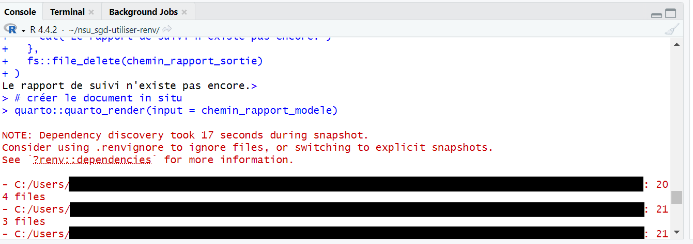
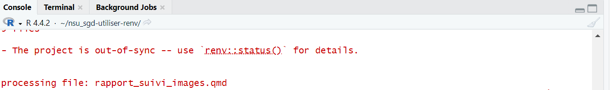

# Introduction

## Background

For an ongoing project, I'm sharing R projects with non-R users to run. To give these projects the best chance of working on someone else's machine, I use `renv` for me to capture, and for users to get, package dependencies. In addition, I try to build checks in the project on whether system dependencies are present (e.g., RTools for compile non-R source code in packages, Quarto for rendering reports, etc.)

Nevertheless, I've encountered a few issues and anticipate a more. Hence, to better protect my project against problems, I'm seeking guidance on what I can do, either more, differently, or both.

## Project to review

The project can be found [here](https://github.com/ehcvm3/nsu_sgd).

Since the README and comments are in French, let me a bit about what the project does, how it works, and how it is structured.

### What it does

The project aims to help with several parts of monitoring a data collection project:

- **Getting the data.** Some data are traditional columnar survey data. Other data are images of non-standard units found in surveyed markets.
- **Combining data.** For the data collection software, each version of the CAPI application exports a separate set of data files. For ease of monitoring, the program combines all of these into a single set of files.
- **Organize images.** The data collection software exports images in a file system that makes sense but isn't particularly useful for analysis/monitoring. To address this, the program creates a useful file system and copies raw images into the appropriate place in the new file system, changing the file name in the process to encode other useful info.
- **Creating reports.** For this survey, the data collection teams needs to ensure that both the columnar and image data make sense, separately and together. For each data source, there is one report generated: one for columnar data and any issues found in it; another for images and any associated issues.

### How it works

Rather than a single `main` or `run_all` file, this project has one script per action (e.g., get data, combine data, create reports, etc). For more details, have a look [here](https://github.com/ehcvm3/nsu_sgd?tab=readme-ov-file#utilisation-r%C3%A9guli%C3%A8re). Google Translate should help.

The user is meant to interact with the project as follows:

1. Open the project as an R project
1. Run one of the numbered scripts in the root of the project.

By opening the project as an R project, R runs the `renv` activation script stored in the `.Rprofile` file that that package generates.

By running a numbered script, R executes the necessary actions for the script's job.

### How it is structured

Thanks to `renv`, the project contains a lockfile of dependencies, a `renv/` folder containing the project-specific library, and an `.RProfile` file for activating `renv`.

The top-level scripts source scripts that are either common to all scripts or specific to that script. There is a numbered folder that matches each script in the root of the project. Those folders are each structured like the canonical R project (e.g. what you might get with `usethis::create_project()`)

## Issues encountered

### What has happened

For the current round of this project, I've already seen some issues, albeit before I shared an `.Rproj` file for users to click to open the project in RStudio.

The first issue is that `renv` is a bit too verbose about performance issues. Because of the coloring, users take these to be errors.

The second issue is that `renv` signals that the project is out of date. This is likely because the project was not opened as such, and `renv` didn't otherwise have a way to activate.

For past rounds of this project, when I also used `renv`, I noticed a different set of problems--mainly related to users not being able to install packages specified in the `renv` lockfile. See more [here](https://github.com/arthur-shaw/ehcvm2_rejet?tab=readme-ov-file#lancer).

For all cases, regrettably, I don't have a full picture of what happened and why.

### What I expect to happen

I expect a few issues to arise:

1. Users will mistake `renv`'s verbose warnings/messages as errors.
1. Users will not open the project as an R project, but instead directly attempt to run numbered scripts in the root of the project.
1. `renv` will fail to install dependencies, and the root cause will not be clear, requiring further manual investigation and remediation (e.g., user doesn't have RTools, has wrong version of R, etc.)

# Questions for review

- How can I check the project has been opened as a project?
- How can I trigger `renv` to do its thing even if the user hasn't opened the project in the "right way" that automatically run `renv`'s activation script.
- How can I run system diagnostics before renv attempts to install dependencies (e.g. check that RTools/build tools installed before `renv` attempts to install a package like dplyr that requires compilation)?
- How can I suppress `renv`'s verbose output when it is more distracting (for non-R users) than useful?
- Are there other system dependencies I should check for, and if so how?
